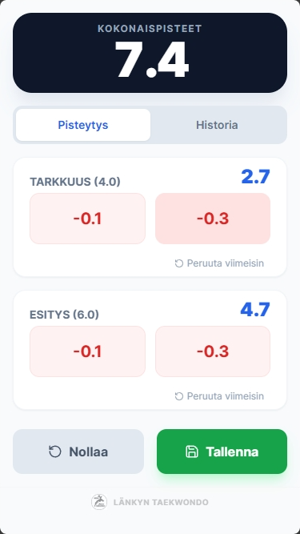
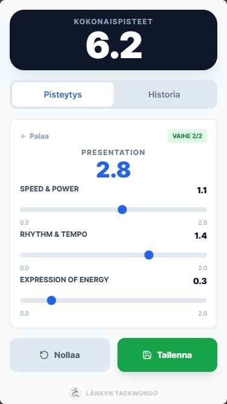
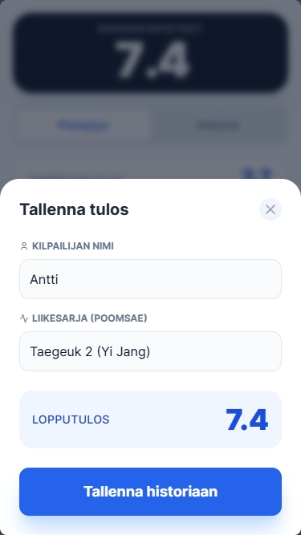
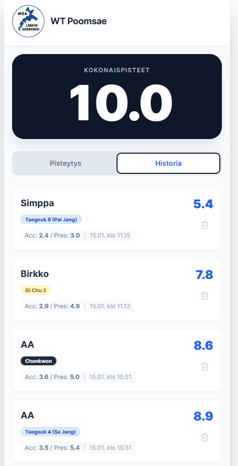
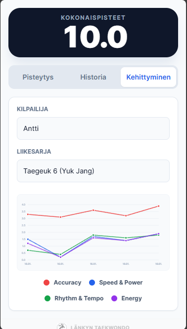

# WT Poomsae Scorer

Moderni ja helppokäyttöinen PWA-sovellus (Progressive Web App) Taekwondo Poomsae -suoritusten pisteytykseen WT-säännöillä (World Taekwondo). Sovellus on suunniteltu erityisesti seuran sisäiseen harjoituskäyttöön ja tuomariharjoitteluun.

## 📱 Kuvakaappaukset

| Tarkkuus | Presentaatio | Tallennus | Historia | Kehittyminen |
|:---:|:---:|:---:|:---:|:---:|
|  |  |  |  |  |

*Sovelluksen päänäkymät: Pisteytys tarkkuus, pisteytys presentaatio, Suorituksen tallennus, Historia ja Kehittyminen.*

## ✨ Ominaisuudet

- **Virallinen pisteytys:** Accuracy (4.0) ja Presentation (6.0) lähtöpisteet.
- **Isot painikkeet:** Helppo käyttää katsomatta näyttöön (-0.1 ja -0.3 vähennykset).
- **Presentaation pisteytys:** Helppo arvioida presentaatio suorituksen jälkeen virallisten osapisteiden mukaan (Speed & Power, Rhythm & Tempo, Expression of Energy)
- **Älykäs kumoaminen (Undo):** Mahdollisuus perua viimeisin vähennys virhepainalluksen sattuessa.
- **Liikesarjojen tuki:** Valitse suoritettava liikesarja (Gi Chu, Taegeuk 1-8, Mustien vöiden sarjat).
- **Historia:** Tallentaa suoritukset laitteen muistiin (LocalStorage).
- **Kehittymisen seuranta:** Visuaalinen graafi, jolla voi seurata kilpailijan kehitystä (Accuracy, Speed, Rhythm, Energy) eri liikesarjoissa.
- **Offline-tila:** Toimii ilman verkkoyhteyttä asennuksen jälkeen.

## 🚀 Asennus puhelimeen (PWA)

Sovellus toimii suoraan selaimessa, mutta parhaan käyttökokemuksen saat asentamalla sen kotivalikkoon, jolloin se toimii kuin natiivisovellus.

### iOS (iPhone / iPad)
1. Avaa sovellus **Safari**-selaimella.
2. Paina **Jaa-painiketta** (nuoli laatikosta ylöspäin) alavalikossa.
3. Valitse listasta **"Lisää Koti-valikkoon"** (Add to Home Screen).
4. Paina yläkulmasta **Lisää**.

### Android (Chrome)
1. Avaa sovellus **Chrome**-selaimella.
2. Jos selain ei ehdota asennusta automaattisesti, paina oikean yläkulman kolmea pistettä (**Menu**).
3. Valitse **"Asenna sovellus"** tai **"Lisää aloitusnäyttöön"**.

---

## 🛠️ Käyttöohje

1. **Aloitus:** Pisteet ovat oletuksena täydet (4.0 / 6.0).
2. **Pisteytys:** Seuraa suoritusta ja paina vähennyspainikkeita virheiden mukaan.
   - Pienet virheet: **-0.1**
   - Isot virheet: **-0.3**
3. **Korjaus:** Jos painat väärin, paina kyseisen osion **Peruuta**-nappia palauttaaksesi pisteet.
4. **Presentaatio:** Suorituksen jälkeen paina **Suoritus päättyi** ja anna presentaatiopisteet kolmella liukusäätimellä.
4. **Tallennus:** Suorituksen lopuksi paina **Tallenna**.
   - Syötä kilpailijan nimi.
   - Valitse tai kirjoita liikesarja (esim. "Taegeuk 4").
5. **Nollaus:** Voit aloittaa alusta tallentamatta painamalla **Nollaa**. Tämä nollaa sekä presentaation, että tarkkuuden pisteet.
6. **Historia:** Näet aiemmat suoritukset Historia-välilehdellä. Voit poistaa virheellisiä tallennuksia roskakori-ikonista.
7. **Kehittyminen:** Valitse "Kehittyminen"-välilehti, syötä kilpailijan nimi ja liikesarja nähdäksesi graafin kehityksestä (Accuracy, Speed, Rhythm, Energy).

---

## 💻 Kehitys ja asennus (Developers)

Tämä projekti käyttää Vue 3:a ja Tailwind CSS:ää ilman raskaita komponenttikirjastoja.

### Esivaatimukset
- Node.js asennettuna

### Asennus
```bash
# 1. Kloonaa repo
git clone https://github.com/duxx/Vibe-Poomsase.git

# 2. Asenna riippuvuudet
npm install
```

### Testaus
```bash
# käyttää vitestia
npm run test
```

### Dev (kehitysversio)
```bash
# Käynnistä kehityspalvelin
npm run dev
```

### Build (tuotantoversio)
```bash
npm run build
# Valmis sovellus löytyy /dist kansiosta
```